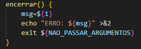
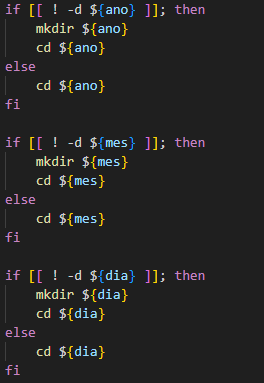
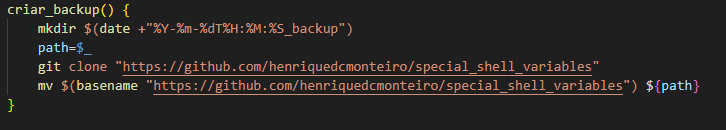
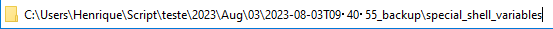
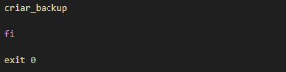

<h2 p align="center" > Backup em estruturas com <b><i>timestamp</i></b>. </h2>

## Passo 1 - Declarando shebang.

 - Declaramos o <b>shebang bash</b> como padrão para a execução do script.

    - #!/bin/bash

## Passo 2 - Saindo do código após um erro.

 - Utilizamos o argumento <b>"set -u -e"</b>. Quando a execução do script encontrar um erro, tanto em um pipeline ou em uma variável unset o script para com o exit referente.

    - set -u -e

## Passo 3 - Constante.

 - Criamos uma constante (apenas leitura), com um valor determinado para a saída da função encerrar que falaremos abaixo. 

    - readonly NAO_PASSAR_ARGUMENTOS=150

## Passo 4 - Função encerrar e encapsulamento.

 - Criaremos uma função que vai encerrar o script caso o gatilho da condição seja atendido. 

 - A função é simples, ela vai encerrar o script caso a condicional abaixo seja atendida, nesse caso usaremos essa função caso se passe qualquer argumento após a execução do script. 

 - De forma um pouco mais detalhada, ela vai pegar o valor do<i>input</i> e vai armazenar na variável <b>msg</b> depois ela vai concatenar o echo "ERRO:" com a string que colocaremos após a evocação da função encerrar, jogando o valor do <i>input</i> em uma <b>stderr</b> que poderá ser consultado depois caso se direcione a saída do script com <b>"2>"</b>. 

 - E por último ela encerra o script com o valor da nossa constante declarada acima. 

 - Depois apenas envolvemos a nossa estrutura em um <b>if-else</b>, onde caso se passe qualquer argumento após a execução do script no terminal, evoca-se a função encerrar, que por sua vez para o script com a mensagem determinada, podendo ser consultado o valor de saída com o <b>$?</b>, que vai mostrar o valor da constante determinada como <b>stderr</b> da função encerrar. 

## Passo 5 - Estrutura de criação de diretórios.

 - Primeiro declaramos a variável neste exemplo "$ano", que vai receber o valor do ano do formato date. 

 - A segunda variável <b>"$mes"</b> vai armazenar o valor da segunda fileira do binário date, que estamos procurando a sigla de cada mês, como, por exemplo, jan, feb, mar, etc. 

 - A terceira variável neste exemplo, <b>"$dia"</b>, que vai receber o valor do dia do formato date. 

    ano=$(date +"%Y")
    mes=$(date | cut -d " " -f 2)
    dia=$(date +"%d")

 - A estrutura é bem simples e segue a mesma lógica em cascata. Ela vai pegar o valor das variáveis em questão e vai perguntar se o diretório não existe, caso não exista crie-se um diretório com o valor da variável e depois entra-se neste mesmo diretório, caso o diretório já exista ele apenas entra no diretório. 

 - A lógica segue-se na estrutura que queremos, de ano, mês e dia até chegarmos no destino que é uma pasta com o valor do dia, entrando neste diretório. 

 - Podemos pensar na estrutura de navegação da seguinte forma: ../"ano"/"mês"/"dia"/.. 

## Passo 6 - Função de backup.

 - A função tem uma lógica interessante que falaremos por partes. 

 - Em primeiro momento criaremos um novo diretório estando dentro de toda aquela estrutura de pastas citada acima. Este novo diretório sera criado com o nome partindo da evocação do binário date, seguindo a formatação escolhida <b>%Y-%m-%dT%H:%M:%S</b> que respectivamente é ANO-MÊS-DIA-(T é apenas um carácter que usei para dar mais visibilidade na separação de data para horário, referenciando a "TIME")HORA:MINUTOS:SEGUNDOS terminando com a string <b>_backup.</b> 

 - Na segunda instrução nós vamos armazenar o valor do <i>command substitution</i> que vai ser nosso último comando executado dentro da variável que criamos com o nome de <b>path</b> utilizando a variável especial <b>"$_"</b>.

 - Então dentro dessa variável vai estar o resultado de <b>"$(date+"%Y-%m-%dT%H:%M:%S_backup")"</b>. 

 - A terceira instrução eu apenas clonei outro repositório de minha autoria que farei de exemplo de backup. Nota-se que ainda este clone esta fora da pasta que acabamos de criar com o <b>"mkdir $(date +"%Y-%m-%dT%H:%M:%S_backup")"</b>. 

 - Por último vamos pegar o binário <b>basename</b> do link que clonamos, armazenando o valor pegando apenas o último nome após o padrão <b>/</b> que é <b>"special_shell_variables"</b>. Depois esse basename é direcionado para o binário <b>mv</b>, movendo esta pasta clonada que no caso seria <b>"special_shell_variables"</b> para dentro do diretório criado anteriormente que está armazenado na variável <b>$path</b>, passando a variável no final da instrução. 
 

 
 - Quando rodamos o script podemos notar que criamos esta arvore de backup com exito, podendo ser adaptado para qualquer link. 

<i> - Detalhe, o <i>Windows</i> não reconhece como nome de pastas o carácter ":"; por isso, fica como uma bolinha separando a hora, minuto e segundo.</i>

 ## Passo 7 - Evocar e final.

 - Agora apenas evocamos a função e criamos o nosso arquivo de backup dentro da pasta referente ao ano, mês e dia, também marcando nessa pasta a hora, minuto e segundo de sua criação. 

