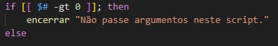
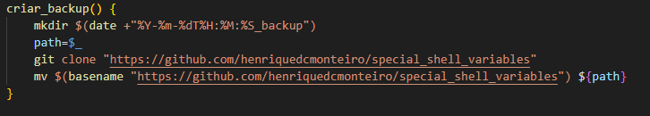

<h3 p align="center" > <i>Forgive me for any grammatical errors, English is not my native language. </i> </h3>

<h2 p align="center" > Backup structures with <b><i>timestamp</i></b>. </h2>

## Step 1 - Declaring a shebang.

 - We declare <b>shebang bash</b> as the default for script execution.

    - #!/bin/bash

## Step 2 - Exiting the code after an error.

 - We use the argument <b>"set -u -e"</b>. When the script execution encounters an error, either in a pipeline or in an unset variable, the script stops with the corresponding exit.

    - set -u -e

## Step 3 - Constant.

 - We create a constant (read-only), with a given value for the output of the close function that we will talk about below. 

    - readonly NAO_PASSAR_ARGUMENTOS=150

## Step 4 - Function closure and encapsulation.

 - We will create a function that will terminate the script if the condition trigger is met. 

 - The function is simple, it will terminate the script if the conditional below is met, in this case we will use this function if any argument is passed after the script is executed. 

 - Explaining in more detail, it will take the value of the input and store it in the variable <b>msg</b> then it will concatenate the echo "ERROR:" with the string that we will put after the evocation of the terminate function, storing the value of the input in a <b>stderr</b> that can be consulted later if you direct the output of the script with <b>"2>"</b>. 

 - And finally it terminates the script with the value of our constant declared above. 

 - Then we just wrap our structure in a <b>if-else</b>, where if any argument is passed after the execution of the script in the terminal, the terminate function is evoked, stoping the script with the given message, and the output value can be queried with the b>$?/b>, which will show the value of the constant determined as b>stderr</b> of the terminate function. 

## Step 5 - Directory creation structure.

 - First we declare the variable in this example "$ano", (that means year), which will receive the year value from the date format. 

 - The second variable <b>"$mes"</b> (that means month), will store the value of the second row of the binary date, which we are looking for the abbreviation of each month, such as, Jan, Feb, Mar, etc. 

 - The third variable in this example, <b>"$dia"</b>, (that means day), will receive the day value from the date format. 

    ano=$(date +"%Y")
    mes=$(date | cut -d " " -f 2)
    dia=$(date +"%d")

 - The structure is very simple and follows the same logic in cascade. It will take the value of the variables in question and will ask if the directory does not exist, if it does not exist create a directory with the value of the variable and then enter in this same directory, if the directory already exists it just enters in the directory. 

 - The logic follows the structure that we want, of year, month and day until we reach the destination which is a folder with the value of the day, and entering in this directory. 

 - We can think of the navigation structure as follows: ../"year"/"month"/"day"/.. 

## Step 6 - Backup function.

 - The function has an interesting logic that we will talk about in parts. 

 - First we will create a new directory being inside all that folder structure mentioned above. This new directory will be created with the name starting from the evocation of the date binary, following the chosen formatting <b>%Y-%m-%dT%H:%M:%S</b> which respectively is YEAR-MONTH-DAY-(T is just a character I used to give more visibility in the separation of date to time, referring to "TIME")HOUR:MINUTES:SECONDS ending with the string <b>_backup.</b> 

 - In the second statement we will store the value of the command substitution that will be our last command executed inside the variable we created with the name <b>path</b> using the special variable <b>"$_"</b>.

 - So inside this variable will be the result of <b>"$(date+"%Y-%m-%dT%H:%M:%S_backup")"</b>. 

 - The third instruction I just cloned another repository of my own that I will make as an example backup. Note that this clone is still outside the folder we just created with the <b>"mkdir $(date +"%Y-%m-%dT%H:%M:%S_backup")"</b>. 

 - Finally we will take the binary b>basename/b> of the link we cloned, storing the value taking only the last name after the pattern <b>/</b> which is <b>"special_shell_variables"</b>. Then this basename is directed to the binary <b>mv</b>, moving this cloned folder which in this case would be <b>"special_shell_variables"</b> into the previously created directory that is stored in the variable <b>$path</b>, passing the variable at the end of the statement. 
 

 
 - When we run the script we can see that we have successfully created this backup tree, which can be adapted to any link. 

<i> - Detail, <i>Windows</i> does not recognize as folder name the character ":"; therefore, it is like a little ball separating the hour, minute and second.</i>

 ## Step 7 - Evoke and final.

 - Now we just evoke the function and create our backup file inside the folder referring to the year, month and day, also marking in this folder the hour, minute and second of its creation. 

